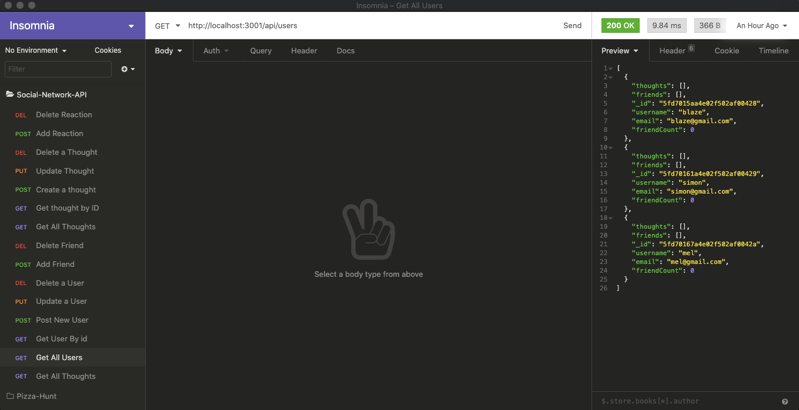

# socialNet-workAPI

## Description

The project for the week was to create the backend of a social network API using NOSQL. We used MongoDB to store data inside of server. MongDB is a very flexible piece of technology and provides advantages over MySQL for databases that are continuously changing. In this application we can store users and their e-mails. Users can store thoughts and then other users can react to those thoughts. There is also a friend function within the application that allows to users to create a friendship between one another.

## Table of Contents

* [Installation](#installation)
* [Usage](#usage)
* [License](#license)
* [Contributing](#contributing)
* [Links](#links)
* [Questions](#questions)

## Installation 

Run 'npm install' in the command line to install all the necessary dependencies if trying to run the app locally.

## Usage

To access this application download the code and run 'npm start' in the root of the directory. Then open insomnia and follow the route paths in the routes directory to store data in the database.

## Licenses

* MIT

## Contributing

* Aaron Centeno

## Technologies Used
* Express
* Node Modules
* GitHub
* JavaScript
* Terminal
* MongoDB

## Screenshots

## Links

Tutorial Video(s):  (pt. 1): https://drive.google.com/file/d/16EDcYqp7YlSLX1JrHYNSn0Bbpn5W6tUa/view
                    (pt. 2): https://drive.google.com/file/d/1JLxjDF4p-7oekei1DZWffwnJwRjN12Se/view

GitHub Repo: https://github.com/aaroncenteno/socialNet-workAPI

## Questions

Contact Information for questions: 

GitHub: [aaroncenteno](https://www.github.com/aaroncenteno) 

E-mail: asamcent@gmail.com